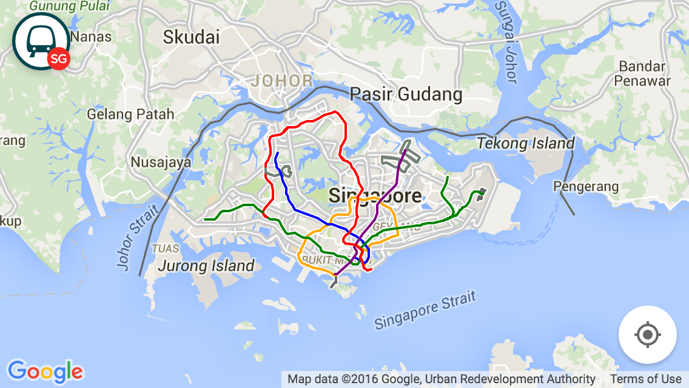

RailRouter SG
===

Yes I know, weird name. Following the same mistake I did for [BusRouter.SG](https://github.com/cheeaun/busrouter-sg).

**RailRouter SG** is a **progressive web app** that lets you explore MRT and LRT rail routes in Singapore. Powered by [**Service Worker**](http://www.html5rocks.com/en/tutorials/service-worker/introduction/) and **works offline**.

It's meant to [scratch my curiosity itch](https://twitter.com/cheeaun/status/683495506031448064) for comparing the *real* route lines VS the lines shown on Google Maps, which I personally find too *straight* and skews the perception of how trains actually travel in the real world. Yeah, kind of like the feeling of being trolled by Google Maps. Get it?

Anyway, these are awesome features available:

- **Real** rail route lines, for all train routes, *including* Sentosa Express line and Changi Line.
- Checkbox to show Google's own transit layer, so that you can compare.
- Show station names in Chinese and Tamil if available, besides English.
- Show location of exits (aka entrances) for almost all stations.
- Let me repeat, **works offline**.

That's it.

Technicalities
---

The *real* route lines come from OpenStreetMap here: http://wiki.openstreetmap.org/wiki/Mass_Rapid_Transit_%28Singapore%29

The JSON files are in `data` folder. `all.json` is for *all* routes and stops, while other files are individual lines.

Here's a sprinkle of yarn magic:

- `yarn` - install everything
- `yarn run lines` - scrape the lines from OpenStreetMap
- `yarn run lines-all` - generate `all.json` from the scraped lines
- `yarn run exits-all` - scrape exits fron OneMap.sg and regenerate `all.json`
- `yarn run wikipedia-all` - fetch data from Wikipedia and regenerate `all.json`
- `yarn run all` - run `lines`, `lines-all`, `exits-all` and `wikipedia-all`
- `yarn run inliner` - inline all assets from `_index.html` to `index.html`
- `yarn run watch` - watch files and run `inliner` when files changed
- `yarn run serve` - run a local server
- `yarn start` - runs both `watch` and `serve`

License
---

Data: [© OpenStreetMap contributors](http://www.openstreetmap.org/copyright) and [OneMap](http://www.onemap.sg/home/).

Everything else: [MIT](http://cheeaun.mit-license.org/)
